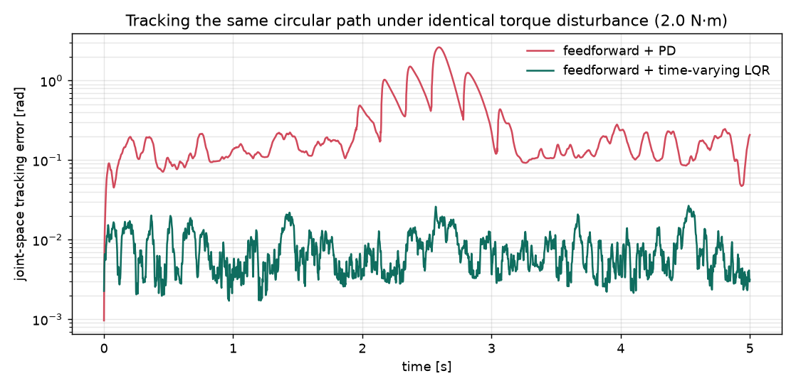

# Robot arm planning and control

A KUKA LBR iiwa7 in Pinocchio, with analytical inverse kinematics, feedforward
torque from recursive Newton-Euler, time-varying LQR tracking, and a
probabilistic roadmap that plans around obstacles.

I started this project mainly to learn a robotics library properly, and I
picked Pinocchio because it is what a lot of modern robotics code is built on.
The arm has seven joints, so it is redundant and there is a whole family of
joint configurations that put the end effector in the same place, which ends up
mattering once the roadmap gets built.



Both controllers are running the same circular path under the same 2 N·m torque
disturbance. The PD controller wanders up to 2.62 rad off the reference while
the LQR stays under 0.027 rad.

## Inverse kinematics

There is a damped least squares Newton solver in `inverse_kinematics.py`, but
this arm also has a closed-form analytical solution, which is what most of the
project uses. Because the arm is redundant, that solution is a circle of valid
elbow positions rather than a single answer, and `redundancy_ik.py` sweeps
around it to get the whole family.

## From a trajectory to torques

A task-space trajectory maps into joint space one waypoint at a time. That only
gives positions, so `spline.py` fits a cubic spline to get velocities and
accelerations out of it, and then Pinocchio's recursive Newton-Euler gives the
feedforward torque that would produce that motion.

## Control

`control.py` has both the PD controller and the time-varying LQR backward pass.

The PD gains have to be scaled by each joint's own inertia, because the wrist
and the shoulder are orders of magnitude apart and a single gain stiff enough
for one of them is unstable on the other. That works, but it is fragile. The
LQR removes the problem completely by linearizing about each point along the
trajectory and solving a Riccati recursion backward along it, which leaves
nothing to tune beyond the two cost matrices. What it costs is memory, since
there is now a gain matrix at every timestep.

## Planning

`prm_sampling.py` samples the task space, `self_collision.py` and
`external_collision.py` filter the resulting configurations, `prm_roadmap.py`
builds a sparse weighted graph over whatever survives, and `prm_query.py` runs
Dijkstra between two poses. The path that comes back goes through the same
spline fit and the same LQR tracking as everything else.

## Running it

```bash
python -m venv arm_env
source arm_env/bin/activate
pip install pin numpy scipy meshcat

jupyter notebook main.ipynb          # IK, splines, PD and LQR tracking
jupyter notebook PRM_obstacles.ipynb # roadmap with obstacles
```

The roadmap data in `data/` is not committed because it is large, but both PRM
notebooks rebuild it.

Rendering the figures needs a few extra packages:

```bash
pip install matplotlib trimesh pycollada
python render_animation.py --tour 5   # arm_prm_tour.mp4
python render_tracking_plot.py        # arm_tracking_pd_vs_lqr.png
```
